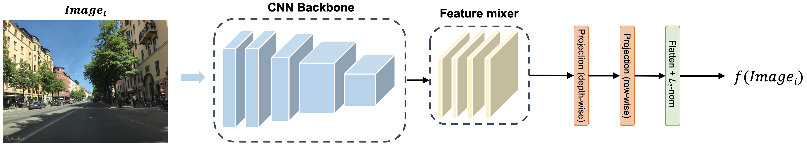
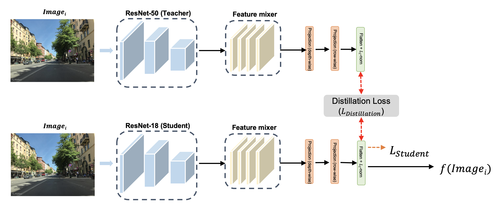

# Lightweight-MixVPR

### Summary

Lightweight CNN Backbone following 3 Feature Extractor:

1. EfficientNet
2. MobileNetV2
3. Knowledge-Distillation



- Teacher network: ResNet 50
- Student network: ResNet18


### Weights

<table>
<thead>
  <tr>
    <th rowspan="2">Backbone</th>
    <th rowspan="2">Output<br>dimension</th>
    <th colspan="3">Pitts30k-test</th>
    <th colspan="3">MSLS-val</th>
    <th rowspan="2">DOWNLOAD<br></th>
  </tr>
  <tr>
    <th>R@1</th>
    <th>R@5</th>
    <th>R@10</th>
    <th>R@1</th>
    <th>R@5</th>
    <th>R@10</th>
  </tr>
</thead>
<tbody>
  <tr>
    <td>ResNet50 (MixVPR)</td>
    <td>4096</td>
    <td>91.99</td>
    <td>95.79</td>
    <td>96.66</td>
    <td>87.03</td>
    <td>92.57</td>
    <td>94.73</td>
    <td><a href="https://drive.google.com/file/d/1ZmmTGn_8upcJ5huXS42_Yq-vHd8Bxo_v/view?usp=drive_link">LINK</a></td>
  </tr>
  <tr>
    <td>EfficientNet_b0</td>
    <td>1280</td>
    <td>81.51</td>
    <td>91.83</td>
    <td>94.06</td>
    <td>65.00</td>
    <td>78.38</td>
    <td>81.89</td>
    <td><a href="https://drive.google.com/file/d/1FKG3Q4JlmN3i0FcixZYZXuEtVySmVW1_/view?usp=drive_link">LINK</a></td>
  </tr>
  <tr>
    <td>MobileNet v2</td>
    <td>512</td>
    <td>86.30</td>
    <td>92.99</td>
    <td>94.66</td>
    <td>70.14</td>
    <td>81.35</td>
    <td>83.65</td>
    <td><a href="https://drive.google.com/file/d/1zwumBOinylXe77KwDhZjUffwxGLyx3s9/view?usp=drive_link">LINK</a></td>
  </tr>
  <tr>
    <td>KD</td>
    <td>256</td>
    <td>89.00</td>
    <td>94.72</td>
    <td>96.07</td>
    <td>81.49</td>
    <td>88.92</td>
    <td>91.22</td>
    <td><a href="https://drive.google.com/file/d/1C3dLL5-IVEuLKWp5laZAwiEwP2feQw9J/view?usp=drive_link">LINK</a></td>
  </tr>
</tbody>
</table>

Code to load the pretrained weights is as follows:

```
from main import VPRModel

# Note that images must be resized to 320x320
model = VPRModel(backbone_arch='resnet50', 
                 layers_to_crop=[4],
                 agg_arch='MixVPR',
                 agg_config={'in_channels' : 1024,
                             'in_h' : 20,
                             'in_w' : 20,
                             'out_channels' : 1024,
                             'mix_depth' : 4,
                             'mlp_ratio' : 1,
                             'out_rows' : 4},
                )

state_dict = torch.load('./LOGS/resnet50_MixVPR_4096_channels(1024)_rows(4).ckpt')
model.load_state_dict(state_dict)
model.eval()
```

code to rune Demo (demo_query.py)

```
python demo_query.py --model [backbone model] --query [path to query] --database [path to database]
```


## Bibtex

```
@inproceedings{ali2023mixvpr,
  title={MixVPR: Feature Mixing for Visual Place Recognition},
  author={Ali-bey, Amar and Chaib-draa, Brahim and Gigu{\`e}re, Philippe},
  booktitle={Proceedings of the IEEE/CVF Winter Conference on Applications of Computer Vision},
  pages={2998--3007},
  year={2023}
}
```
